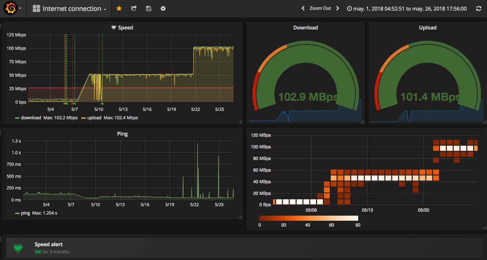

## Monitoring the bandwidth with Grafana, InfluxDB and Docker for Raspberry Pi

It is a fork of this [repository](https://github.com/gonzalo123/speed "repository"), with small changes to run in a Raspberry Pi.

## Instructions

1) You need to clone the repository

2) You must change the environment variables, with the information you need in the .env file

3) The docker-compose file allows us to orchestrate the infrastructure. Thanks to the work of @ gonzalo123, the project is configured to display a custom board using the Grafana API. You only need to execute the following instruction to launch the project containers:

    docker-compose up -d

4) When the containers are built, you can enter the grafana board in the web browser. Remember to use the values you set in the .env file as user and password (GF_SECURITY_ADMIN_USER and GF_SECURITY_ADMIN_PASSWORD).

Example:

	http://RaspberryIP:3000/